# core-java


### shared lock (Only Read)
### Exclusive lock (Read and Write)
    there are two thread T1 and T2 is T1 acquiring shared lock (Read Lock) and thead T2 also allow shared lock
    If any thread like Thread T1 put a shared lock then thread T2 can not allow exlusive lock.
    Exlusive lock only allow when there is no lock on particular resource except exclusive lock


## Lambda
### Benefit
1. To enable functional programming
2. More readable ,maintainable and concise code
3. To use APIs very easily and effectively
4. To enable parallel processing

What is the Lambda expression??

It is a anonymous function

### Anonymous function
---------------------------------
1. Without name
2. Without return type
3. Without modifiers
----------------------------------
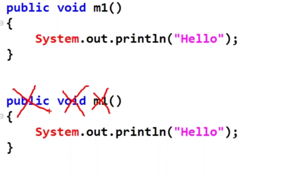

No name -->remove m1
No return type --> remove void
no modifier -->remove public

```
() {
system.out.println("Hello");
}

how will convey this is lambda
there is tequire special symbol
->

()-> {system.out.println("Hello");}

if body contain one line than curly braches optional

()-> system.out.println("Hello");
```


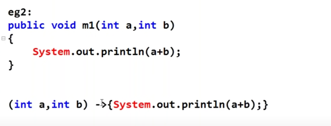
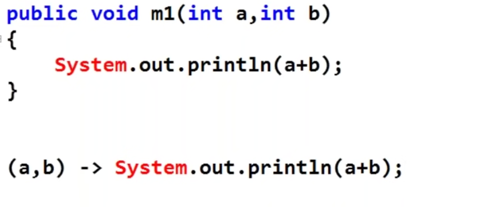

``
If you want to return something without curly braces
the remove the return keyword otherwise use the {} curly braces with return 

(n)->{ return n*n;}
(n)->n*n;

if method have only one argument their is not require bracket()

n->n*n
``


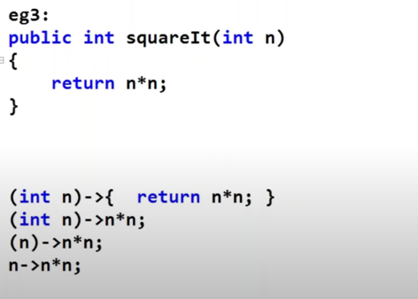

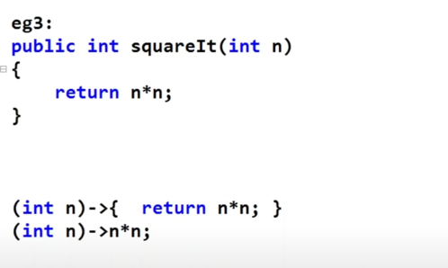

## Functional Interface
word is new 
concept is old

1. Runnable == run()
2. Comparable == compareTo
3. Comparator == compare()
4. ActionListener == actionPerformed
5. Callable == call()
All these interface have only one  public abstract method

SAM == Single abstract method


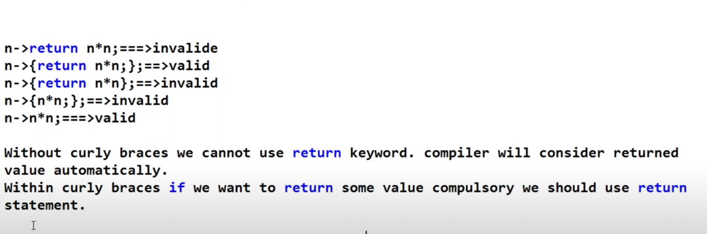

```

once we write the Lambda Expresssion

use Functional Iterface
SAM -- Which contain Single Abstract Method

Can take default and static method inside fuctional interface??
Yes

Any numbers of defalut methods and any number of static method  
only and exactly only and only abstract method


```
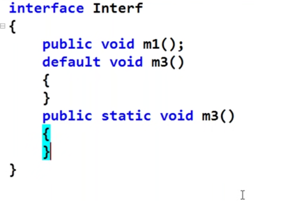

### Functional Interface wrt to Inheritance

Where the problem in this ??

no issue
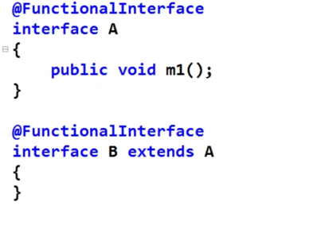


is this valid 
it is perfectly valid because it is override
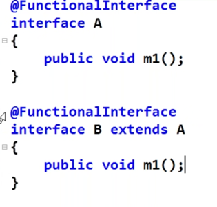


is this invalid ??
yes invalid due to m2() method
Problem is interface B because you are using @FunctionalInterface

then you have to declared abstract method in B
if you declared abstract method in B Then B interface have
two abstract method that is ventilating the property of
functional interface

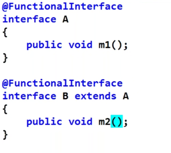

is it is valid ??
it is perfectly valid


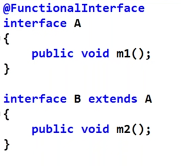

## Lambda Expression with Functional Interface

is this valid ??
Yes 

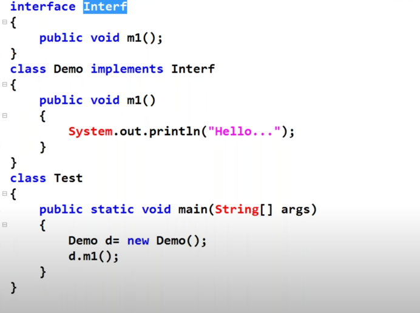

is this valid ??
yes 

Parent Object reference can have a whole child Object

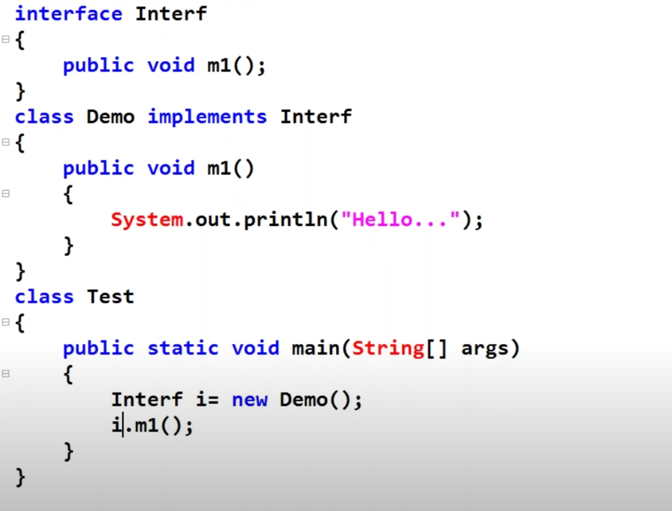


Lambda

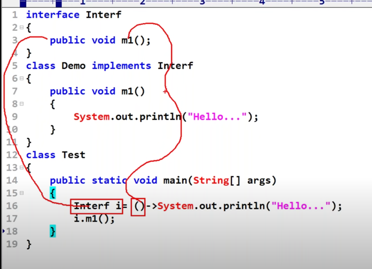
compiler automatic detect
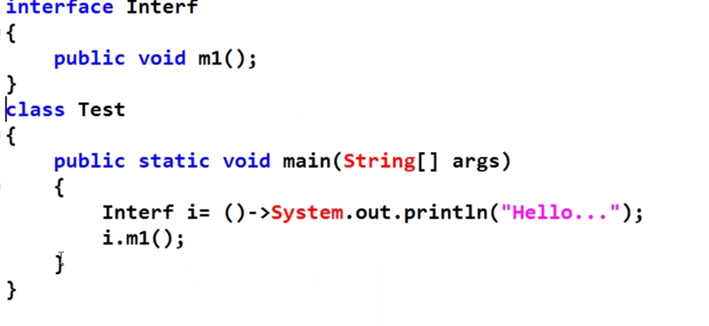

eg.

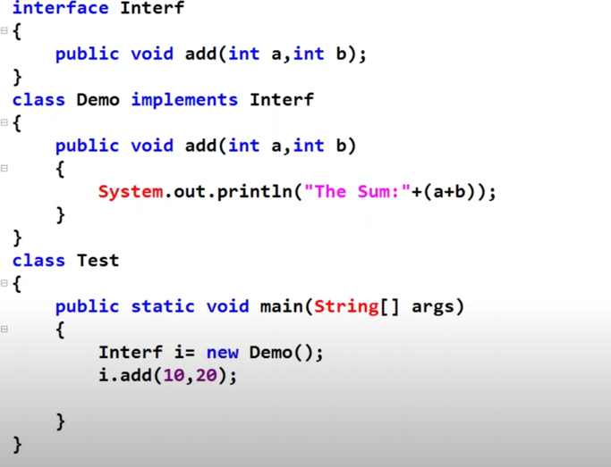
lambda
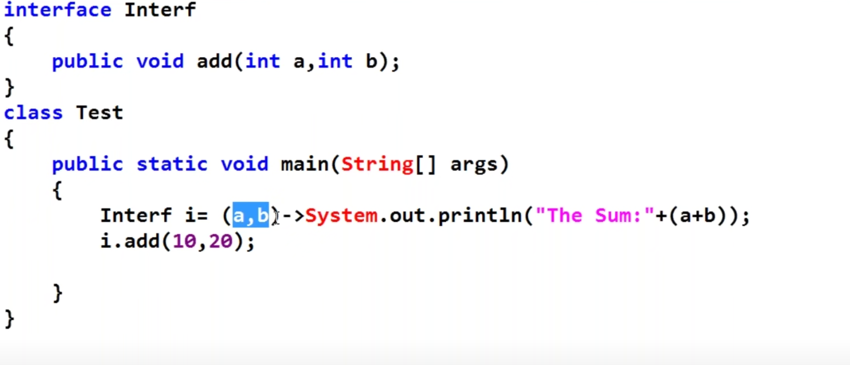

write the points whatever there on screen in pages of notes pages with pen
write the points whatever there on screen in pages of notes pages
write the points whatever there on screen in pages of notes
write the points 


